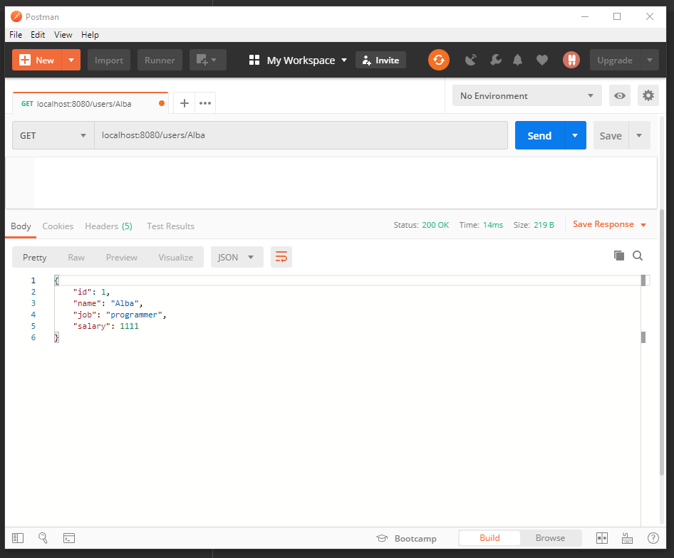

# SimpleSpringCRUD
This is a simple CRUD made with Spring Boot
Dependencies used are:

-Web

-JPA

-H2 Database

This simple application demonstrates the MVC design pattern.

Model (which is a java class that defines the data that will be rendered to the view)

View (is the UI built with HTML, CSS and Javascript, in our application we do not have a view)

Controller(contains the business logic of our application)

At com.alba.simplecrudspring we have 3 packages and .java class; controller package which has UsersController controller, model package which has Users model, repository which has UsersJpaRepository repository and the main class which we run.

The main url is localhost:8080/users
The urls that we use are:

-localhost:8080/users/all => it will fetch all the users from the database

-localhost:8080/users/name => it will fetch only the user who has the name=name

-localhost:8080/users/create => it will create a new user 

-localhost:8080/users/update/id => it will update the user with id=id

-localhost:8080/users/delete/id => it will delete the user that has the id=id

Now lets see it in action:

# Creating a User: localhost:8080/users/create

# Fetching all Users: localhost:8080/users/all

# Fetching the User by name: localhost:8080/users/name

# Updating a User: localhost:8080/users/update/id

# Fetching all after the update: localhost:8080/users/all

# Deleting a User: localhost:8080/users/delete/id

# Fetching all after the delete: localhost:8080/users/all

Thank You!

